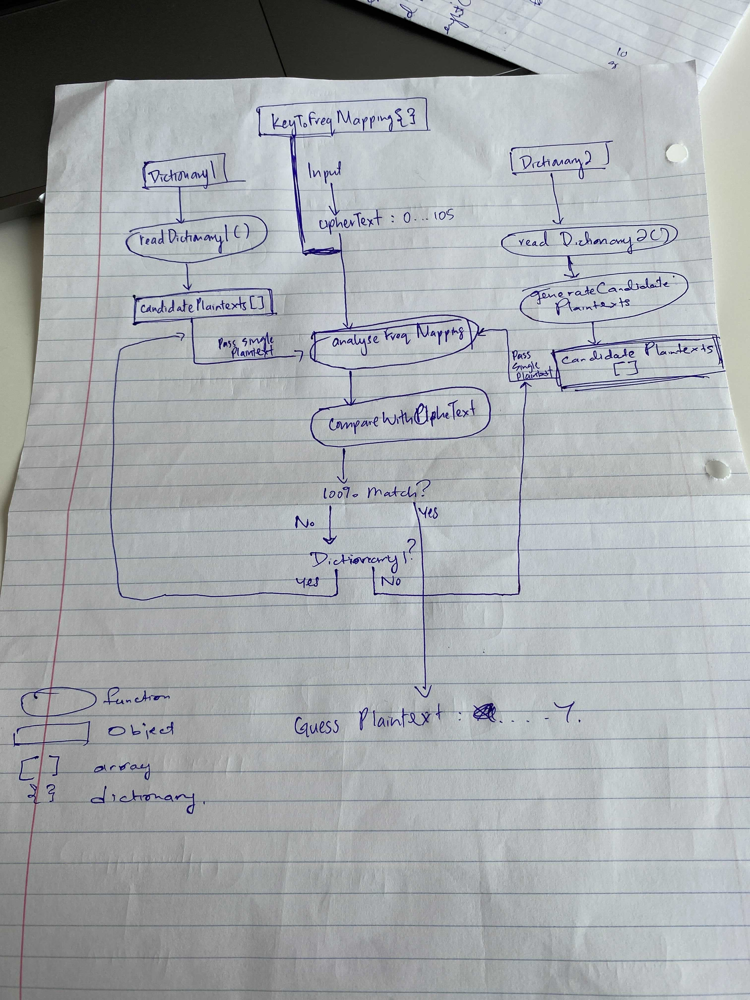

#Project 1 - CryptAnalysis Tool

##Program Overview:

    Ciphertext -> CryptAnalysis(Using words in dictionary1 + dictionary2) -> Plaintext

##Components:
    1. Plaintext  -> Space seperated words from English dictionary1
    2. Key        -> Map from each english alphabet(lower case) to list of numbers(Randomly chosen between 0 to 100)
                     Length of list is the (rounded) letter's frequency in English text, as defined in table below.
                    
                    ```
                    Alphabet    Average frequency   Key Values(randomly chosen distinct numbers between 0 and 105)
                    <space>     19                  k(<space>,1),…,k(<space>,19)
                    a           7                   k(a,1),…,k(a,7)
                    b           1                   k(b,1)
                    c           2                   k(c,1),k(c,2)
                    d           4                   k(d,1),…,k(d,4)
                    e           10      	        k(e,1),…,k(e,10)
                    f           2
                    g           2
                    h           5
                    i           6
                    j           1
                    k           1
                    l           3
                    m           2
                    n           6
                    o           6
                    p           2
                    q           1
                    r           5
                    s           5
                    t           7
                    u           2
                    v           1
                    w           2
                    x           1
                    y           2
                    z           1          
                ```
    3. Ciphertext -> A sequence of common-seperated numbers between 0 to 105

##Example:
    For instance, assume k(<space>,1)=76,...,
    k(<space>,19)=94, 
    k(b,1)=23, 
    k(c,1)=11, 
    k(c,2)=98, 
    k(g,1)=34, 
    k(g,2)=56. 
    Then the plaintext “cbcb gbgg gcb” may be encrypted as “98,23,11,23,79,34,23,56,34,82,34,11,23”. 

    c  b  c  b  <space>  g  b  g  g  <space>  g  c  b
    98 23 11 23   79     34 23 56 34   82     34 11 23

##Tests:
    Test1 - 
    
    Test2 - 

##Questions: 
    i.   Do we need use dictionary list? 
    ii.  Are we suppose to do frequency or brute force base attack?
    iii. In the plaintext that's being fed, will there always be a space between 2 different words?
    iv.  Clarification on the first testcase. A sample of a possible L=100 and q=5 plaintext?


input -> Cryptanalysis -> output

input:  Always 500 characters. 
        For Test 1, encrypted version of one of the plaintext. 
        For Test 2, combinations of the words repeated to create 500 characters

# { 
    # 1: ['b', 'k', 'j', 'q', 'v', 'x', 'z'], 
    
    # 2: ['c', 'g', 'f', 'm', 'p', 'u', 'w', 'y'], 
    # 3: ['l'], 
    # 4: ['d'], 
    # 5: ['h', 's', 'r'], 
    # 6: ['i', 'o', 'n'], 
    # 7: ['a', 't'], 
    # 10: ['e'], 
    # 19: [' ']
#}

##Cryptanalysis Strategy:
    - For each low frequency characters, based on the occurence of the word frequency and position. Find if it's possibly that plaintext.  

For example, within the following plaintext:

    abcawqer bwerijoiq bweroibb

Words with frequency appear at(CAPSLOCKED):

    aBcawQer BweiJoiQ BweroiBB 

So each time the characters with frequency appears at the right position... 
we can add 10% to the probability. If the text hits 100% probability, we know it's highly likely the possible plaintext.

For test2, we will generate a list of all possible plaintext for the 30 words. Assuming there will always be one space 
between each word. Whichever generated candidate plaintext hits 100% first... would be our guess(NOTE THIS GUESS WOULDN'T
BE 100% ACCURAGE BUT MORE OR LESS THERE)

input -> Cryptanalysis[ read_dictionary1() -> Find probabilty of plaintext based on freq and position -> ]


##Program Flow
